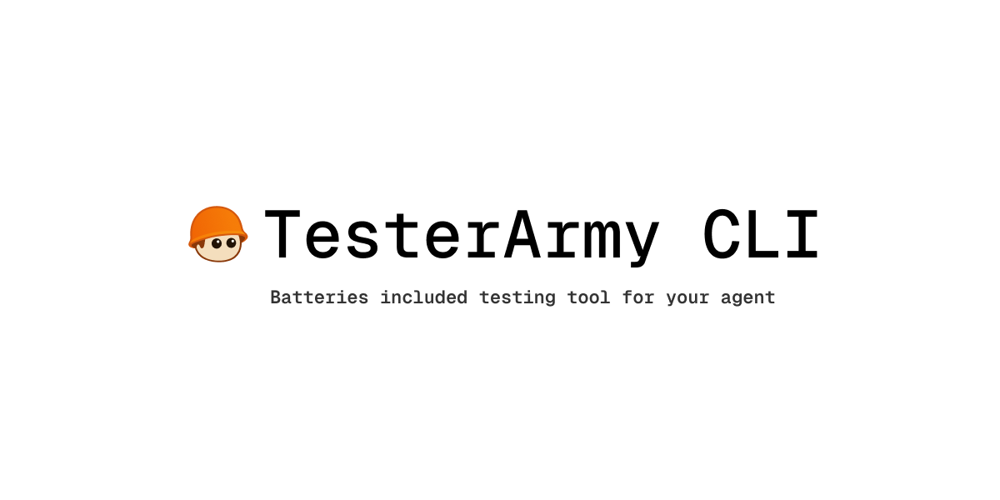

<p align="center">
  
</p>

<p align="center">
  <a href="#quickstart"><strong>Quickstart</strong></a> |
  <a href="https://tester.army/docs"><strong>Docs</strong></a> |
  <a href="https://tester.army"><strong>Platform</strong></a> |
  <a href="https://tester.army/dashboard/profile/api-keys"><strong>API Keys</strong></a> |
  <a href="#skill-installation"><strong>Skills</strong></a> |
  <a href="#examples"><strong>Examples</strong></a>
</p>

<p align="center">
  <a href="https://www.npmjs.com/package/testerarmy"></a>
  <a href="https://www.npmjs.com/package/testerarmy"></a>
  <a href="./LICENSE"></a>
</p>

## AI QA agent that clicks through your website like a real human.

TesterArmy CLI (`testerarmy` / `ta`) is an agent-first QA runner.

- Run browser checks from plain prompts.
- Run reusable markdown scenarios (`tests/*.md`).
- Get deterministic pass/fail output plus local artifacts.
- Feed concrete validation back to coding agents.

Start here:

- Docs: [tester.army/docs](https://tester.army/docs)
- Platform: [tester.army](https://tester.army)
- API keys:
  [tester.army/dashboard/profile/api-keys](https://tester.army/dashboard/profile/api-keys)

https://github.com/user-attachments/assets/f7524c3f-018e-46eb-9bae-cb69335fda64

</p>

## Quickstart

Install globally:

```bash
npm install -g testerarmy
```

Then create API key:

[tester.army/dashboard/profile/api-keys](https://tester.army/dashboard/profile/api-keys)

Authenticate (pick one):

```bash
ta auth
```

Or run without install:

```bash
npx testerarmy --help
```

Run a test scenario:

```bash
ta run examples/tests/01-landing-page.md --url "http://localhost:3000"
```

## Skill Installation

Use skills CLI install:

```bash
npx skills add tester-army/cli
```

## Examples

Use starter examples in `examples/`.

- `examples/TESTER.md`
- `examples/tests/01-landing-page.md`
- `examples/tests/02-auth-smoke.md`
- `examples/tests/03-project-create.md`
- `examples/prompts/ad-hoc-regression.md`

Run a full smoke batch:

```bash
ta run examples/tests/ --url "http://localhost:3000" --parallel 3
```

## Contributing

PRs welcome, especially for:

- improving skill quality and references
- better issue templates and triage process
- better real-world test examples

## License

MIT
